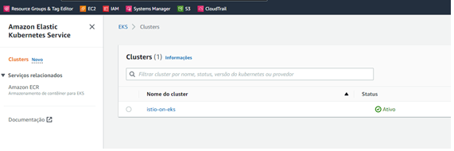
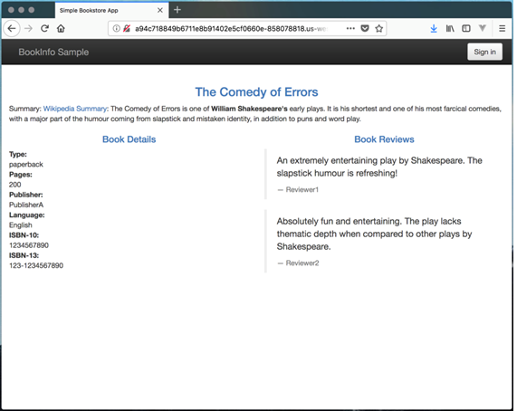

**SET UP AWS-CLI, KUBECTL, EKSCTL, EKS (K8S in AWS), GO BINARY AND AWS-IAM-AUTHENTICATOR**

**1 – In your computer&#39;s CLI, follow the instructions below to install aws-cli (~2 minutes).**

| mkdir EKSLAB; cd EKSLAB |
| --- |
| curl &quot;https://awscli.amazonaws.com/awscli-exe-linux-x86\_64.zip&quot; -o &quot;awscliv2.zip&quot; |
| unzip awscliv2.zip |
| sudo ./aws/install
\*If aws-cli is already installed on your system then do: sudo ./aws/install --update |
| aws --version |

**2 – In your computer&#39;s CLI, follow the instructions below to install kubectl (~2 minutes).**

| curl -LO https://dl.k8s.io/release/$(curl -L -s https://dl.k8s.io/release/stable.txt)/bin/linux/amd64/kubectl
curl -LO https://dl.k8s.io/release/v1.22.0/bin/linux/amd64/kubectl |
| --- |
| sudo install -o root -g root -m 0755 kubectl /usr/local/bin/kubectl |
| echo &#39;source \&lt;(kubectl completion bash)&#39; \&gt;\&gt;~/.bashrc |
| kubectl version --client --output=yaml |

**3 – In your computer&#39;s CLI, follow the instructions below to install eksctl (~2 minutes).**

For further information, see:[**https://docs.aws.amazon.com/eks/latest/userguide/eksctl.html**](https://docs.aws.amazon.com/eks/latest/userguide/eksctl.html)

| curl --silent --location &quot;https://github.com/weaveworks/eksctl/releases/latest/download/eksctl\_$(uname -s)\_amd64.tar.gz&quot; | tar xz -C /tmp |
| --- |
| sudo mv /tmp/eksctl /usr/local/bin |
| eksctl version |

**4 – In your computer&#39;s CLI, follow the instructions below to set up the EKS cluster in AWS (~10 minutes).**

| eksctl create cluster --region sa-east-1 \--name istio-on-eks \--nodes 2 \--ssh-public-key &quot;~/.ssh/id\_rsa.pub&quot; \--profile aws-dasa-security-hml |
| --- |

**5 - Now, you must set up go. Follow the instructions below to install the go binary (~5 minutes).**

For further information, see: [https://go.dev/doc/install](https://go.dev/doc/install)

In your computer&#39;s CLI, type the follow commands:

| sudo rm -rf /usr/local/go |
| --- |
| curl --silent --location &quot;https://dl.google.com/go/go1.18.2.linux-amd64.tar.gz&quot; --output go1.18.2.linux-amd64.tar.gz |
| sudo tar -C /usr/local -xzf go1.18.2.linux-amd64.tar.gz |
| export PATH=$PATH:/usr/local/go/bin |
| go version |

**6 – After go has been installed, another binary must be installed using go (~10 minutes).**

| go install sigs.k8s.io/aws-iam-authenticator/cmd/aws-iam-authenticator@master |
| --- |

**7 – Follow the instructions below to check the communication with EKS (~2 minutes).**

| rm -f ~/.kube/config |
| --- |
| aws eks update-kubeconfig \--region sa-east-1 \--name istio-on-eks \--profile aws-dasa-security-hml |
| kubectl get nodes |
| kubectl get pods --all-namespaces |

Once all settings above have been done, let&#39;s start HELM + TILLER + Istio setup.

**SET UP HELM + TILLER**

**1 – In your computer&#39;s CLI, follow the instructions below to install HELM (~2 minutes).**

For further information, see: [**https://v2.helm.sh/docs/using\_helm/#installing-helm**](https://v2.helm.sh/docs/using_helm/#installing-helm)

| curl https://baltocdn.com/helm/signing.asc | sudo apt-key add - |
| --- |
| sudo apt-get install apt-transport-https --yes |
| echo &quot;deb https://baltocdn.com/helm/stable/debian/ all main&quot; | sudo tee /etc/apt/sources.list.d/helm-stable-debian.list |
| sudo apt-get update |
| sudo apt-get install helm2 |

**2 - In your computer&#39;s CLI, follow the instructions below to install the service account for Tiller&#39;s access (~5 minutes).**

| vim rbac-config.yaml
Paste the follow and save:
apiVersion: v1kind: ServiceAccountmetadata:name: tillernamespace: kube-system---apiVersion: rbac.authorization.k8s.io/v1kind: ClusterRoleBindingmetadata:name: tillerroleRef:apiGroup: rbac.authorization.k8s.iokind: ClusterRolename: cluster-adminsubjects:- kind: ServiceAccountname: tillernamespace: kube-system
 |
| --- |
| kubectl apply -f rbac-config.yaml |
| helm init --service-account tiller --history-max 200 |
| kubectl get serviceaccounts --all-namespaces | grep -i &quot;tiller&quot; |

**SET UP ISTIO**

**1 – In your computer&#39;s CLI, follow the instructions below to install ISTIO (~7 minutes).**

| curl -L https://istio.io/downloadIstio | sh - |
| --- |
| export PATH=&quot;$PATH:~/EKSLAB/istio-1.13.3/bin&quot; |
| helm repo add istio [https://istio-release.storage.googleapis.com/charts](https://istio-release.storage.googleapis.com/charts) |
| helm repo update |
| kubectl create namespace istio-system |
| helm install --name istio-base istio/base --namespace istio-system |
| helm install --name istio-cni istio/cni --namespace istio-system |
| istioctl install --set profile=demo -y |
| kubectl label namespace default istio-injection=enabled |
| kubectl get namespace --all-namespaces |

**SET UP APPLICATION BOOKINFO**

**1 – In your computer&#39;s CLI, follow the instructions below to install bookinfo app (~5 minutes).**

| kubectl apply -f ~/EKSLAB/istio-1.13.3/samples/bookinfo/platform/kube/bookinfo.yaml |
| --- |
| kubectl apply -f ~/EKSLAB/istio-1.13.3/samples/bookinfo/networking/bookinfo-gateway.yaml |

**ACCESS THE APPLICATION BOOKINFO**

**1 – In your computer&#39;s CLI, follow the instructions below to get the app&#39;s URL (~2 minutes).**

| export INGRESS\_HOST=$(kubectl -n istio-system get service istio-ingressgateway -o jsonpath=&#39;{.status.loadBalancer.ingress[0].hostname}&#39;) |
| --- |
| export INGRESS\_PORT=$(kubectl -n istio-system get service istio-ingressgateway -o jsonpath=&#39;{.spec.ports[?(@.name==&quot;http2&quot;)].port}&#39;) |
| export GATEWAY\_URL=$INGRESS\_HOST:$INGRESS\_PORT |
| echo $GATEWAY\_URL/productpage |

Once you have successfully deployed the application, open your browser and type the URL obtained previously. The follow page will be displayed on your browser:

**TRAFFIC ROUTING WITH ISTIO**

**1 – In your computer&#39;s CLI, follow the instructions below to manipulate the routing to the application Bookinfo (~5 minutes).**

| kubectl apply -f ~/EKSLAB/istio-1.13.3/samples/bookinfo/networking/destination-rule-1.yaml |
| --- |
| kubectl apply -f ~/EKSLAB/istio-1.13.3/samples/bookinfo/networking/destination-rule-all.yaml |
